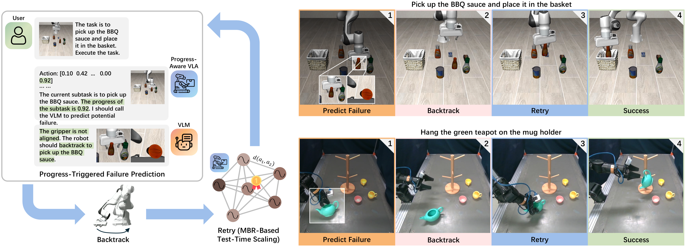

# CycleVLA: Proactive Self-Correcting Vision-Language-Action Models via Subtask Backtracking and Minimum Bayes Risk Decoding

In this work, we introduce CycleVLA, a system that enables VLAs to anticipate incipient failures and recover before execution collapses.

<p align="center">
  
  <br>
  <b>Overview of CycleVLA.</b>
</p>

**Project website: https://dannymcy.github.io/cyclevla/**

**Paper: https://arxiv.org/abs/2601.02295**

**Summary video: https://www.youtube.com/watch?v=09W81JMbF1E**

## System Requirements

Training:
* 4 or 8 A100 GPUs with 40 GB VRAM

Inference:
* 1 GPU with ~24 GB VRAM

## Installation

CycleVLA supports two VLA backbones, OpenVLA-OFT and pi0.5. See [SETUP.md](SETUP.md) for instructions on setting up the environments. See [LIBERO.md](LIBERO.md) for setting up the LIBERO and LIBERO-Plus simulation benchmark and generating our subtask-decomposed dataset.

## Training and Evaluation

See [OPENVLA.md](OPENVLA.md) for finetuning/evaluating the OpenVLA-OFT backbone on the LIBERO and LIBERO-Plus simulation benchmark task suites.

See [PI.md](PI.md) for finetuning/evaluating the pi0.5 (openpi) backbone on the LIBERO and LIBERO-Plus simulation benchmark task suites.

## Real-Robot Experiments

If you also use the AgileX PiPER arm with a leader arm follower arm setup (more details in the paper), you can use our real robot code at https://github.com/dannymcy/cyclevla_distal/tree/main. The original codebase is from https://github.com/reeceomahoney/distal.

## Support

If you run into any issues, please open a new GitHub issue.

## Citation

```bibtex
@article{ma2026cyclevla,
  title={CycleVLA: Proactive Self-Correcting Vision-Language-Action Models via Subtask Backtracking and Minimum Bayes Risk Decoding},
  author={Ma, Chenyang and Yang, Guangyu and Lu, Kai and Xu, Shitong and Byrne, Bill and Trigoni, Niki and Markham, Andrew},
  journal={arXiv preprint arXiv:2601.02295},
  year={2026}
}
```
